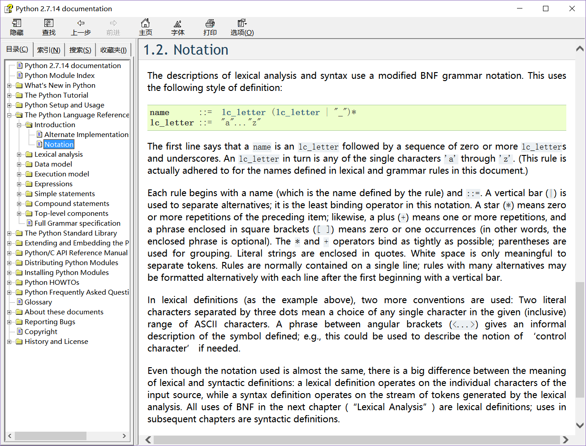

# 我的速查手册

本文只是记录一些自己(曾经或者现在)经常翻查的手册（帮助文档），有些是解释语法的（例如make, python），有些是介绍工具使用的（例如git），写下来是为了自己方便查找。
希望对你也有帮助。

我能下载到的文档，已经放到了：https://github.com/galian123/MyCheatSheet ，需要的话请自取。

一般遇到技术上的问题，通常的做法(除了向他人请教之外)：

* **官方文档**

如果要更好地理解代码，或者理解工具的使用，官方的文档、官方的说明是必读的。官方的文档一般写的都比较简洁了当，只是把要点写出来了，第一次读一般会忽略掉很多细节，之后每一次读都会有不同的体会，这跟读一本书是类似的。

* **搜索引擎**

对于某个知识点，可以通过**搜索引擎**快速上手，查查百度、必应或者谷歌，一般都是可以搜到结果的。

* **stackoverflow**

**[stackoverflow](https://stackoverflow.com)**上的解答，通常可以解决大部分问题。stackoverflow是通过tag来分类，可以到 https://stackoverflow.com/tags 页面中找到问题所属的tag，然后可以在那个分类里搜索。

* **维基百科**

[维基百科](https://en.wikipedia.org/wiki/Main_Page)也是很不错的资源，维基百科对一些概念有较完整的知识体系，从某个词条的引用部分可以找到不少有用的信息，以便进一步学习。

* **github开源项目中的Issue**

对于github中开源项目的问题，通常先去项目的Issue中搜索是否有相同或相似的问题。例如`py-faster-rcnn`的『Issues』，可以看到提交了很多问题，没有解决的问题（Open的）有505个，已经解决的（Closed）有205个。通常你遇到的问题，别人已经遇到，并提交到『Issues』这里了。

BTW： chm文件打开显示空白的问题，可以参考：[解决Windows中chm文件打开后显示空白的问题](FixChmDisplayError.md)

## **&#9733; 1. 遇到的问题**

### **&#9830; 1.1 代码相关的**

阅读代码的过程中，一般会遇到的问题有：

* （1）编译相关的问题: 

    例如make（makefile）的语法、cmake的CMakeLists.txt中用到的语法、gcc的参数等。makefile还会内嵌一些shell命令。

* （2）编程语言相关的问题： 

    例如Java、C++、Python、Javascript等语言的语法。

* （3）操作系统相关的问题：

    例如寄存器、进程、线程、线程池、进程挂起、进程调度、内存分配与释放、内存回收等一些概念，需要阅读操作系统相关的书籍或者文档，达到更清晰的理解。

* （4）各种文件格式、数据格式规范相关的问题：

    例如Android中的dex格式、oat格式、各种图片格式，各种规范（例如SMS规范、MMS规范），动态库（.so文件）的ELF规范等等。

* （5）架构、设计理念相关的问题：

    类似这个困惑：所有的代码语法都能看懂，就是不明白为什么代码写成了这么复杂的样子。这个问题类似于一句英语中的每个单词都认识，就是不能理解这句英语是什么意思。因为代码的背后有一个设计理念，为了方便维护、易于扩展、易于团队协同开发等很多代码外的因素，需要把代码设计成某种模式、或者应用某个框架。理解代码的架构，会对理解代码很有帮助。

本人总结的肯定有遗漏，权且算作是我自己的分类吧，而且分类也是自定义的，仅供参考。

### **&#9830; 1.2 工具相关的**

这个『工具』类别与上面的『代码』类别的差异，用不太恰当的类比，可以比作『黑盒』和『白盒』测试。使用工具基本上可以不用管工具是怎么实现的，更多的关注点在怎么用好工具，例如git工具，我相信读过git源代码的应该不多，我们更多的精力放在如何用好git上。

其实，用好一个工具，有时是需要读一些工具的源代码的，这对解决使用工具时遇到的问题有很大帮助，也会对工具的使用有更深刻的理解。

各种工具就很多了，版本控制工具、各种开源工具、各种专项工具（例如Android Studio用于Android项目的开发）等等，本文只是记录下我用到的一些工具的帮助文档，读者可以根据自身情况整理属于自己的速查手册。

## **&#9733; 2. 速查手册**

再次声明：本文介绍的只是我个人经常查的帮助文档，以官方的文档为主，也包括一些很好的博客、书籍（以电子书为主，方便在电脑中搜索）。能下载到的文档，已经放到了：https://github.com/galian123/MyCheatSheet，读者可以fork，并删改形成自己的版本。

### **&#9830; 2.1 编译相关的**

* **make (makefile)**

	GNU Make Manual: https://www.gnu.org/software/make/manual/  
	GNU make中文手册： http://vdisk.weibo.com/s/uCRMpDBUxfXHq  
	阮一峰老师的 [Make 命令教程](http://www.ruanyifeng.com/blog/2015/02/make.html)

* **cmake**

	https://cmake.org/documentation/

	cmake 3.10（目前最新）帮助文档： https://cmake.org/cmake/help/v3.10/  
	这个页面中也有『Quick Search』，方便搜索。

	cmake 搜索： https://cmake.org/cmake/help/v3.10/search.html

* **shell脚本（bash）**

	shell脚本经常出现在makefile中，所以把shell脚本放到此类别中。这里只是关于bash命令的。  
	GNU bash： https://www.gnu.org/software/bash/  
	GNU Bash manual： https://www.gnu.org/software/bash/manual/

	Advanced Bash-Scripting Guide：http://www.tldp.org/guides.html  
	[abs-guide.html.tar.gz](http://www.tldp.org/LDP/abs/abs-guide.html.tar.gz)  
	[abs-guide.pdf](http://www.tldp.org/LDP/abs/abs-guide.pdf)  
	[高级Bash脚本编程指南.pdf](http://vdisk.weibo.com/s/dIAezeT0Zb8q)

	Bash Guide for Beginners:  
	[Bash-Beginners-Guide.html.tar.gz](http://www.tldp.org/LDP/Bash-Beginners-Guide/Bash-Beginners-Guide.html.tar.gz)  
	[Bash-Beginners-Guide.pdf](http://www.tldp.org/LDP/Bash-Beginners-Guide/Bash-Beginners-Guide.pdf)

### **&#9830; 2.2 编程语言相关的**

* **Java**

	The Java™ Tutorials ： https://docs.oracle.com/javase/tutorial/  
	打包下载离线html格式的java教程： http://www.oracle.com/technetwork/java/javase/java-tutorial-downloads-2005894.html

	Java Language and Virtual Machine Specifications  
	https://docs.oracle.com/javase/specs/index.html

	The Java Language Specification, Java SE 9 Edition  
	https://docs.oracle.com/javase/specs/jls/se9/html/index.html  
	https://docs.oracle.com/javase/specs/jls/se9/jls9.pdf

* **JNI（Java™ Native Interface）**

	https://docs.oracle.com/javase/7/docs/technotes/guides/jni/

	JNI 6.0 API Specification：https://docs.oracle.com/javase/7/docs/technotes/guides/jni/spec/jniTOC.html

	Java Native Interface: Programmer's Guide and Specification： https://web.archive.org/web/20120728074805/http://java.sun.com/docs/books/jni/  
	这时JNI编程规范的很早的版本，介绍了很多JNI的细节的内容。里面有html和pdf版本。  
	[PDF 下载](https://web.archive.org/web/20120728074805/http://java.sun.com/docs/books/jni/download/jni.pdf)  
	[HTML 打包下载](https://web.archive.org/web/20120728074805/http://java.sun.com/docs/books/jni/download/jni_output.zip)

* **Python**

	Python3.x Doc: https://docs.python.org/3/  
	Doc下载：https://docs.python.org/3/download.html  
	chm格式： https://www.python.org/downloads/release/python-364/

	Python2.x Doc: https://docs.python.org/2/  
	Doc 下载： https://docs.python.org/2/download.html  
	chm格式： https://www.python.org/downloads/release/python-2714/

	Dive Into Python 3: http://www.diveintopython3.net/  
	[HTML版下载](https://github.com/diveintomark/diveintopython3/zipball/master)  
	[pdf版下载](https://github.com/downloads/diveintomark/diveintopython3/dive-into-python3.pdf)  
	[Dive Into Python 3 中文版.pdf](http://vdisk.weibo.com/s/a-INpiPBG29Q)

	Dive Into Python(2.x): http://www.diveintopython.net/  
	http://www.diveintopython.net/download/diveintopython-pdf-5.4.zip  
	Dive Into Python 中文版: https://zxytech.com/diveintopython/index.html

	Google Python Style Guide: https://google.github.io/styleguide/pyguide.html

* **c++**

	Standard C++ Library reference: http://www.cplusplus.com/reference/

* **sqlite**

	SQL Syntax： http://www.sqlite.org/lang.html

* **Groovy**

	http://www.groovy-lang.org/documentation.html  
	http://www.groovy-lang.org/syntax.html  
	http://www.groovy-lang.org/closures.html  
	http://www.groovy-lang.org/semantics.html

	Groovy Reference (pdf已下载）： https://dzone.com/refcardz/groovy

* **numpy**

    http://www.numpy.org/  
    术语: https://docs.scipy.org/doc/numpy/glossary.html#glossary  
    numpy快速开始: https://docs.scipy.org/doc/numpy-dev/user/quickstart.html  
    numpy参考手册: https://docs.scipy.org/doc/numpy/reference/  
    numpy基础: https://docs.scipy.org/doc/numpy/user/basics.html  
    numpy维基百科: https://en.wikipedia.org/wiki/NumPy

* **opencv**

    https://docs.opencv.org/  
    这里可以在线查看, 也可以下载到本地,离线查看.  
    opencv2.4: https://docs.opencv.org/2.4/  
    https://docs.opencv.org/2.4/search.html  
    https://docs.opencv.org/2.4/genindex.html  
    opencv master最新的docs: https://docs.opencv.org/master/

### **&#9830; 2.3 操作系统相关的**

* **Dalvik VM**

	https://source.android.com/devices/tech/dalvik/dalvik-bytecode  
	https://source.android.com/devices/tech/dalvik/instruction-formats

	http://netmite.com/android/mydroid/dalvik/docs/  
	http://netmite.com/android/mydroid/dalvik/docs/instruction-formats.html  
	http://netmite.com/android/mydroid/dalvik/docs/dalvik-bytecode.html  
	http://netmite.com/android/mydroid/dalvik/docs/java-bytecode.html

	http://pallergabor.uw.hu/androidblog/dalvik_opcodes.html

* **Java Virtual Machine Specifications**
	https://docs.oracle.com/javase/specs/index.html

	Java SE 9 Edition：  
	https://docs.oracle.com/javase/specs/jvms/se9/html/index.html  
	https://docs.oracle.com/javase/specs/jvms/se9/jvms9.pdf

* **ARM instuctions**

	http://infocenter.arm.com/help/index.jsp  
	http://infocenter.arm.com/help/topic/com.arm.doc.subset.architecture.reference/index.html#reference  
	需要注册，才能下载。

### **&#9830; 2.4 各种文件格式、数据格式规范相关的**

* **dex format**

	https://source.android.com/devices/tech/dalvik/dex-format

* **HTML, CSS, XML, Javascript, etc**

	https://www.w3schools.com/  
	HTML 字符集： https://www.w3schools.com/charsets/default.asp

	http://www.w3school.com.cn/

* **OMA Specifications**

	http://openmobilealliance.org/wp/index.html

* **MMS**

	http://openmobilealliance.org/release/MMS/

* **3GPP 规范**

	http://www.3gpp.org/specifications/specifications

	http://www.3gpp.org/specifications/79-specification-numbering

* **SMS**

	http://www.3gpp.org/DynaReport/23040.htm

* **Markdown**

	https://guides.github.com/features/mastering-markdown/  
	https://help.github.com/articles/basic-writing-and-formatting-syntax/	  
	https://help.github.com/articles/organizing-information-with-tables/  
	https://daringfireball.net/projects/markdown/basics  
	https://daringfireball.net/projects/markdown/syntax  

* **yaml**

    http://www.yaml.org/  
    http://www.yaml.org/spec/1.2/spec.html  
    https://github.com/jbeder/yaml-cpp/  
    https://github.com/jbeder/yaml-cpp/wiki/Tutorial

### **&#9830; 2.5 架构、设计理念相关的**

* **设计模式（Java）**

	https://github.com/iluwatar/java-design-patterns

* **设计模式（Kotlin)**

	https://github.com/dbacinski/Design-Patterns-In-Kotlin

* **Design Patterns for Humans™**

	https://github.com/kamranahmedse/design-patterns-for-humans

* **Python Patterns**

	https://github.com/faif/python-patterns

* **RxJava**

	https://github.com/ReactiveX/RxJava  
	RxJava W`iki： https://github.com/ReactiveX/RxJava/wiki （注：页面右侧有目录）  
	RxJava API doc： http://reactivex.io/RxJava/2.x/javadoc/  
	ReactiveX ： http://reactivex.io/  
	ReactiveX 介绍 ： http://reactivex.io/intro.html  
	GitHub Issues： https://github.com/ReactiveX/RxJava/issues

### **&#9830; 2.6 工具相关的**

* **git**

	git官网Documentation：https://git-scm.com/doc  
	git Reference Manual： https://git-scm.com/docs  
	Pro Git Book: https://git-scm.com/book  
	Pro Git 中文版： https://git-scm.com/book/zh  
	Git权威指南： http://www.worldhello.net/gotgit/

	Learn Version Control with Git: https://www.git-tower.com/learn/git/ebook/en/command-line/introduction  
	Learn Version Control with Git(中文版）：https://www.git-tower.com/learn/git/ebook/cn/command-line/introduction  
	Git FAQ: https://www.git-tower.com/learn/git/faq  
	Git Glossary(术语)： https://www.git-tower.com/learn/git/glossary  
	Git CheatSheet: https://www.git-tower.com/learn/cheat-sheets/git

* **GitHub**

	GotGitHub： http://www.worldhello.net/gotgithub/

* **BNF**

	在sqlite、Python等语法描述中使用。  
	https://en.wikipedia.org/wiki/Backus%E2%80%93Naur_form  
	在python的帮助文档中也有对BNF范式的说明：  
	

* **正则表达式**

	https://en.wikipedia.org/wiki/Regular_expression

* **Maven**

	http://maven.apache.org/guides/index.html  
	学习maven入门最好的资料，就是maven官网上的说明。这个页面上有很多概念解释，对理解maven很有帮助。

	Getting Started in 5 Minutes:  
	http://maven.apache.org/guides/getting-started/maven-in-five-minutes.html

	Getting Started in 30 Minutes  
	http://maven.apache.org/guides/getting-started/index.html

	搜索maven库：http://search.maven.org/  
	[ 查询build.gradle中用到的依赖库的写法 ](http://blog.csdn.net/u013553529/article/details/55113393)

* **Gradle**

	https://gradle.org/guides/  
	Building Android Apps : https://guides.gradle.org/building-android-apps/

	Gradle Plugin User Guide: http://tools.android.com/tech-docs/new-build-system/user-guide  
	https://docs.gradle.org/current/userguide/userguide_single.html

* **Android Plugin DSL Reference**

	DSL 是Domain Specific Language的缩写。

	http://google.github.io/android-gradle-dsl/current/  
	写好AS工程中的build.gradle， 这个官方说明是必读的。

* **Burpsuite**

	【FreeBuf字幕组】Web应用渗透工具BurpSuite教程<引言>  
	http://open.freebuf.com/oversea/tool-oversea/1166.html

	【FreeBuf字幕组】Web应用渗透工具BurpSuite教程<一>测试环境搭建  
	http://open.freebuf.com/oversea/tool-oversea/1172.html

	【FreeBuf字幕组】Web应用渗透工具BurpSuite教程<二>通用概念和代理模块介绍  
	http://open.freebuf.com/oversea/tool-oversea/1180.html

	【FreeBuf字幕组】Web应用渗透工具BurpSuite教程<三> Proxy模块介绍  
	http://open.freebuf.com/oversea/tool-oversea/1182.html

	【FreeBuf字幕组】Web应用渗透工具BurpSuite教程<四> Repeater模块介绍  
	http://open.freebuf.com/oversea/tool-oversea/1184.html

	【FreeBuf字幕组】Web应用渗透工具BurpSuite教程<五> Target和Spider模块介绍  
	http://open.freebuf.com/oversea/tool-oversea/1186.html

	【FreeBuf字幕组】Web应用渗透工具BurpSuite教程<六> Sequencer和Scanner模块介绍  
	http://open.freebuf.com/oversea/tool-oversea/1190.html

	【FreeBuf字幕组】Web应用渗透工具BurpSuite教程<七> Intruder和Comparer模块介绍  
	http://open.freebuf.com/oversea/tool-oversea/1192.html

	【FreeBuf字幕组】Web应用渗透工具BurpSuite教程<八> 结语  
	http://open.freebuf.com/oversea/tool-oversea/1194.html

* **Apktool**

	https://ibotpeaches.github.io/Apktool/documentation/  
	里面有详细的使用说明，跟着说明做一遍，对apktool的功能会有一个初步且比较完整的理解。

* **Wireshark**

	https://www.wireshark.org/docs/

* **gflags**
    
    https://gflags.github.io/gflags/
